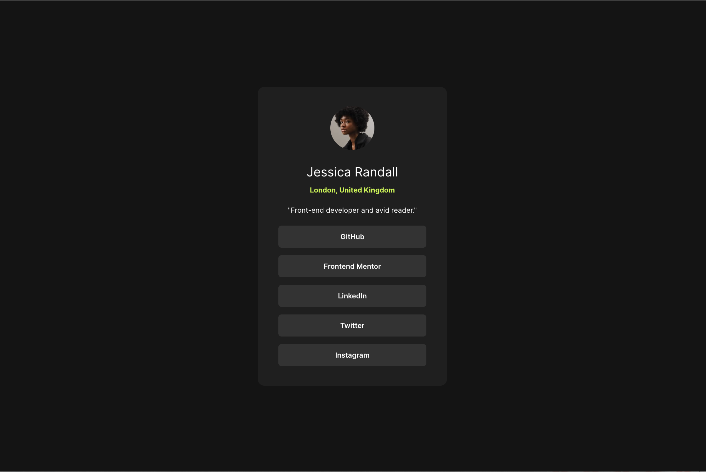

# Frontend Mentor - Social links profile solution

This is a solution to the [Social links profile challenge on Frontend Mentor](https://www.frontendmentor.io/challenges/social-links-profile-UG32l9m6dQ). Frontend Mentor challenges help you improve your coding skills by building realistic projects. 

## Table of contents

- [Overview](#overview)
  - [The challenge](#the-challenge)
  - [Screenshot](#screenshot)
  - [Links](#links)
  - [Built with](#built-with)
  - [What I learned](#what-i-learned)
  - [Continued development](#continued-development)

## Overview
In this small project, you'll build out your social link-sharing profile.

### The challenge

Users should be able to:

- See hover and focus states for all interactive elements on the page

### Screenshot

### Links

- Solution URL: [https://github.com/Babyjenx/social-links-profile-main]
- Live Site URL: [https://babyjenx.github.io/social-links-profile-main/]

### Built with

- HTML
- CSS 
- Flexbox

### What I learned

First time using flexbox in a project. Pretty straightforward and easy to use. I haden't customized buttons as links before either, that was satisfying.

### Continued development

I want to continue working with flexbox and increasing comlexity of projects. I'd also like to implement media queries for tablets and mobile in the future.